# 前端交互原型修改记录

> [!NOTE]
> 本文是 2026-09-07 至 2026-09-08 的历史设计记录，保留截图作为界面演进证据，
> 不是当前产品状态说明。当时的演示数据原型已经由 Issue #14、#15、#17、#19、#20
> 及当前真实 API 与 Chromium E2E 实现取代。当前能力以项目
> [`README.md`](https://github.com/LouisLiuNova/PocketTally#readme)
> 和[《通用前端测试方案与指示》](frontend-testing-plan.md)为准。

## 2026-09-07

- 统计分析的日期范围支持在“本月”“上月”“今年”“近 12 个月”和“自定义”之间切换，统计粒度支持日、周、月切换。
- 支出趋势改为平滑曲线折线图，并保留关键数据点和时间轴。
- 记账弹窗中的一级分类移动到交易类型下方、金额上方，以圆形图标展示；图标颜色使用分类记录指向的色号。
- 金额输入支持简单的加、减、乘、除算式，并实时显示计算结果。
- 交易发生时间支持通过日期时间控件修改。
- 外观支持亮色、暗色和跟随系统三种主题模式。
- 配色提供“瑠璃浅葱”“朱鷺色”“松葉色”“藤紫”四种日本传统色预设。
- 补强宽度变化时的响应式规则，避免工具栏、统计卡片、图表和表单发生挤压或错位。
- “期间支出”和“累计支出”支持切换，并使用不同曲线和口径说明。
- 分类图标调整为更轻量的 Lucide 单色线性图标，分类色仅作为柔和底色和描边。
- 金额区域只显示最终金额；点击后弹出独立小型计算器输入算式。
- 点击一级分类后弹出二级分类选择层，不再在表单底部使用子分类下拉框。
- 记账弹窗中提供分类快捷添加和编辑入口。
- 转账表单改为“转出账户 → 转入账户”，支持交换账户并阻止相同账户提交；转账不显示分类，并注明不进入收支统计。
- 总览增加按实际发生日期展示的收支日历。
- 修复窄宽度侧边栏误隐藏图标的问题，收起后保留居中的导航图标与明确选中态。
- 收支日历调整为总览右侧的紧凑小卡片，与左侧近期流水形成主次布局。
- 收支日历固定显示完整六周月份网格，右上角年月下拉框可追踪历史月份。
- 交易详情抽屉改为完全使用主题变量，避免暗色模式打开时闪白。
- 移除侧边栏底部的用户头像与“本地账本”信息。

## 当时的设计决策汇总（2026-09-08）

### 产品与技术边界

- 原型采用 Nuxt 4 + TypeScript + Nuxt UI，作为桌面优先的单页应用展示。
- 文案使用简体中文，金额统一使用人民币（CNY），日期与时间按 Asia/Shanghai 展示。
- 页面模块固定为：总览、交易、账户、分类与标签、统计分析。
- 当时交付的是可交互前端原型，使用演示数据且尚未接通真实后端接口；该状态已被后续真实 API 实现和 E2E 验收取代。
- 视觉实现优先复用 Nuxt UI 与 Lucide 图标，不引入额外图标体系。

### 全局视觉与主题

- 支持亮色、暗色、跟随系统三种主题模式。
- 支持四套日本传统色预设：瑠璃浅葱（ruri）、朱鷺色（toki）、松葉色（matsuba）、藤紫（fuji）。
- 卡片、抽屉、弹窗、图表和表单控件均通过主题变量取色，避免暗色模式切换时出现白色闪屏。
- 一级分类使用简洁的 Lucide 线性图标；分类色只用于圆形图标底色、描边和图表辅助色，避免大面积高饱和色块。

### 布局与响应式

- 桌面端保留左侧导航 rail 和主工作区；统计卡片、图表和表单按网格排列。
- 视口变窄时，侧栏收缩为保留选中态的图标 rail，不保留用户头像或“本地账本”信息。
- 工具栏、卡片、图表和弹窗允许换行或改为单列，禁止出现横向溢出、重叠和控件错位。
- 总览下方采用“左侧近期流水 + 右侧紧凑收支日历”的主次布局；日历不再占满整行。

### 总览与收支日历

- 总览提供现金流摘要、收入/支出卡片、收支节奏、账户余额、近期流水、消费构成和收支日历。
- 收支日历始终显示完整六周（42 格），包含上月末和下月初的占位日期，保证月份切换时布局稳定。
- 日历右上角年月下拉框用于追踪历史年月；切换月份只改变数据与标题，不改变卡片尺寸。
- 日期格区分净流入、净流出、无记录和非当前月份日期，并保留点击查看当日交易明细的入口。

### 统计分析

- 日期范围支持：本月、上月、今年、近 12 个月、自定义。
- 统计粒度支持：按日、按周、按月。
- 主图使用平滑曲线折线图，保留数据点、坐标轴和口径说明。
- 支出图支持“期间支出 / 累计支出”切换；标题、辅助文案和曲线数据同步切换。
- 退款按原支出发生日期抵减，历史日期的净支出允许随退款发生变化。

### 记账与分类交互

- 交易类型位于弹窗顶部，支持支出、收入、转账、调账。
- 支出和收入在金额上方展示一级分类圆形图标；点击一级分类后以浮层继续选择二级分类，不在表单底部堆叠子分类下拉框。
- 分类浮层提供快捷添加和编辑入口，新增分类后立即回填当前交易。
- 金额输入框只显示最终金额；点击后打开小型计算器，支持 `+`、`-`、`*`、`/`，确认后仅回填计算结果。
- 交易发生时间使用日期时间控件，可修改到具体日期和时间。
- 转账使用“转出账户 → 转入账户”业务表单：必须选择不同账户，不显示分类，不计入收入/支出统计；相同账户时阻止提交并给出明确提示。

### 交易详情

- 交易详情使用右侧抽屉承载，展示金额、入账状态、类型、账户、分类、发生时间和标签。
- 抽屉支持退款、编辑说明与标签等动作；抽屉背景和文字完全跟随主题变量。
- 关闭、退款、编辑等动作保持明确的按钮层级，不使用无提示的静默修改。

### 历史原型截图

以下截图直接来自 ChatGPT 内置浏览器中运行的本地交互原型，作为设计评审基线：

| 页面/状态 | 截图 |
| --- | --- |
| 总览与右侧整月收支日历 | 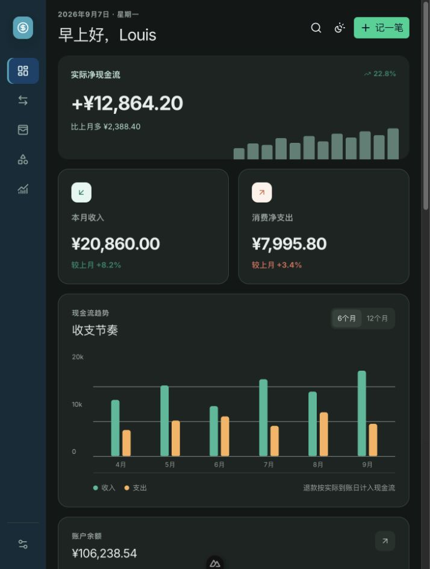 |
| 新增交易弹窗 | 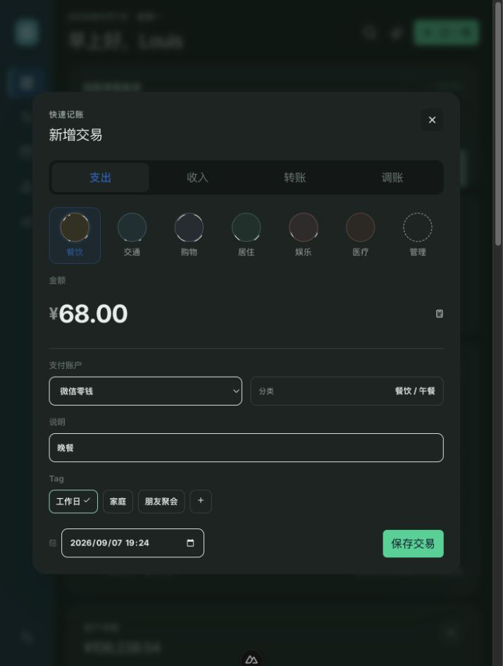 |
| 统计分析与期间/累计支出切换 | 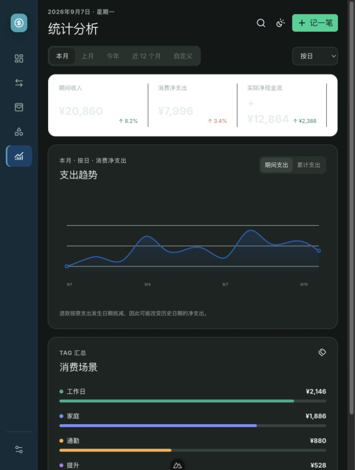 |

截图只用于记录当时的视觉和交互基线。真实数据接入、接口错误态、核心键盘流程和 Chromium
桌面矩阵后来已由 Issue #14、#15、#17、#19、#20 验收；公网权限边界仍由 Issue #22 负责。

### 宽屏细节截图（1644 × 964）

以下截图直接在 ChatGPT 内置浏览器的宽屏视口中截取，保留了导航、卡片网格、图表、整月日历、弹窗和详情抽屉的完整细节：

| 状态 | 宽屏实况截图 |
| --- | --- |
| 总览：现金流、近期流水、消费构成与右侧整月日历 | 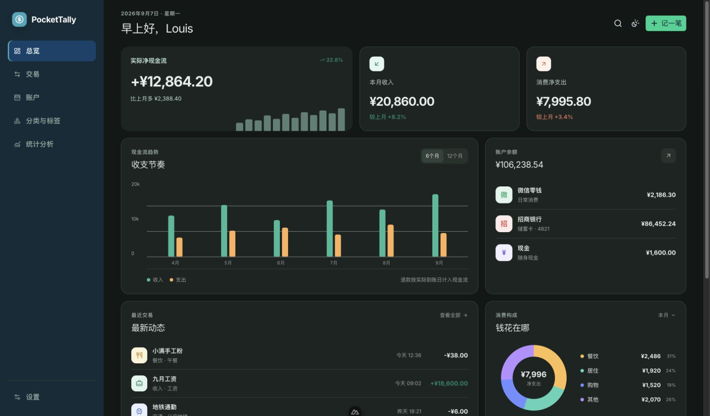 |
| 统计分析：日期范围、粒度、曲线图和期间/累计切换 | 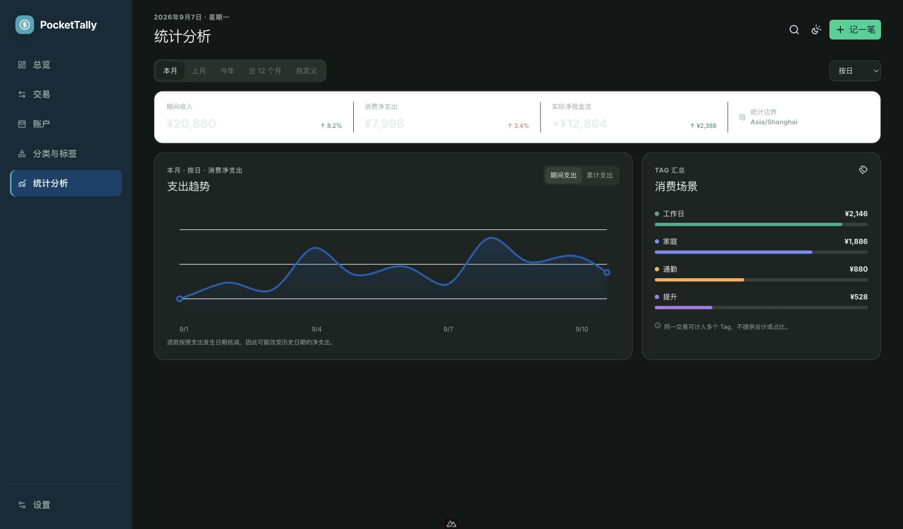 |
| 新增交易：一级分类、最终金额、时间控件和保存动作 | 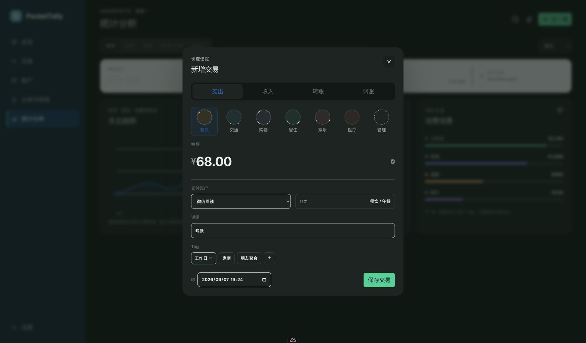 |
| 交易详情：右侧详情抽屉与交易列表 | 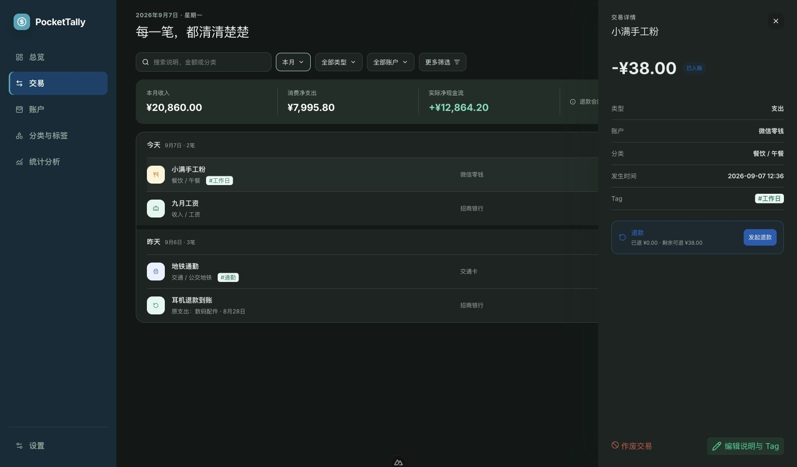 |
| 总览完整页面（含下方日历区域） | 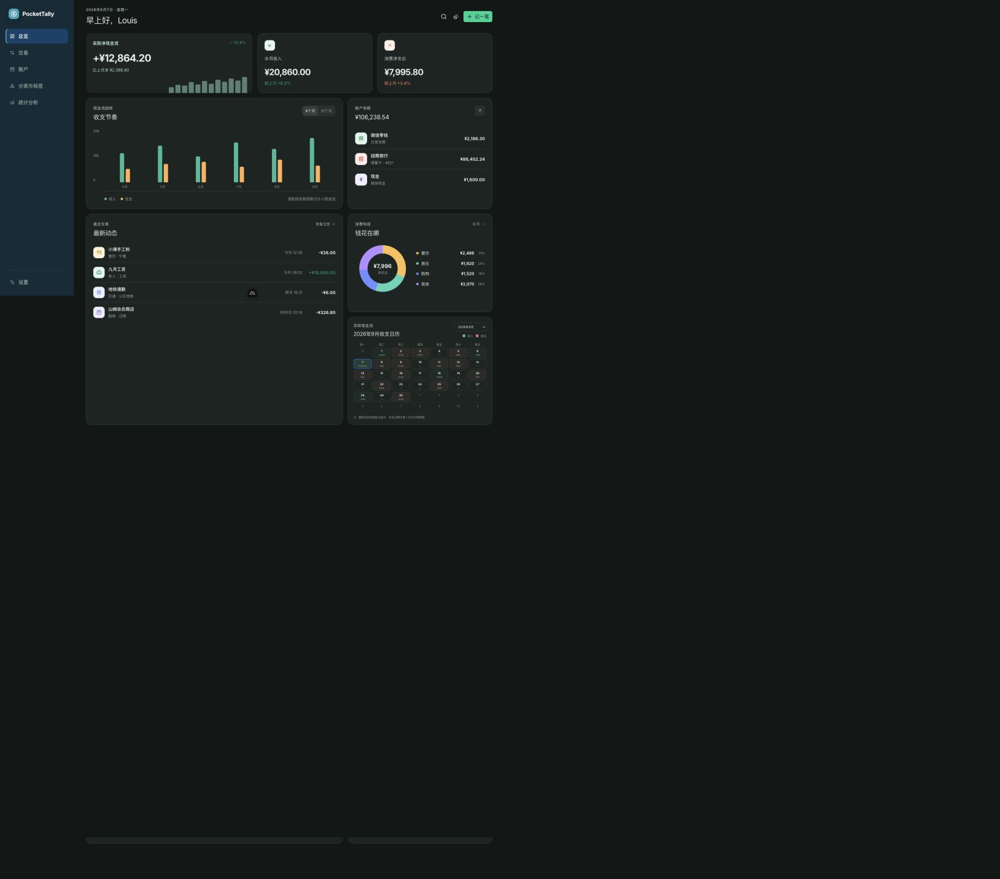 |
| 统计分析累计支出状态 | 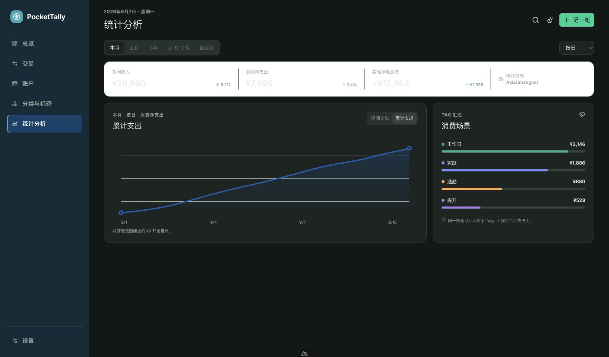 |
| 转账业务表单 | 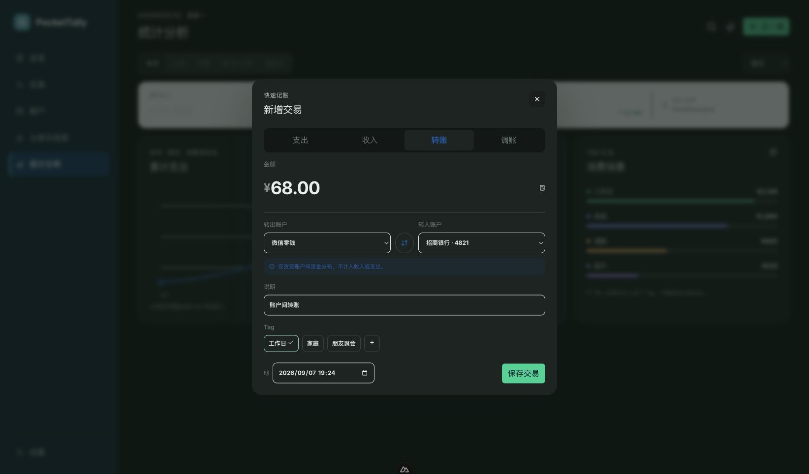 |
| 账户页 | 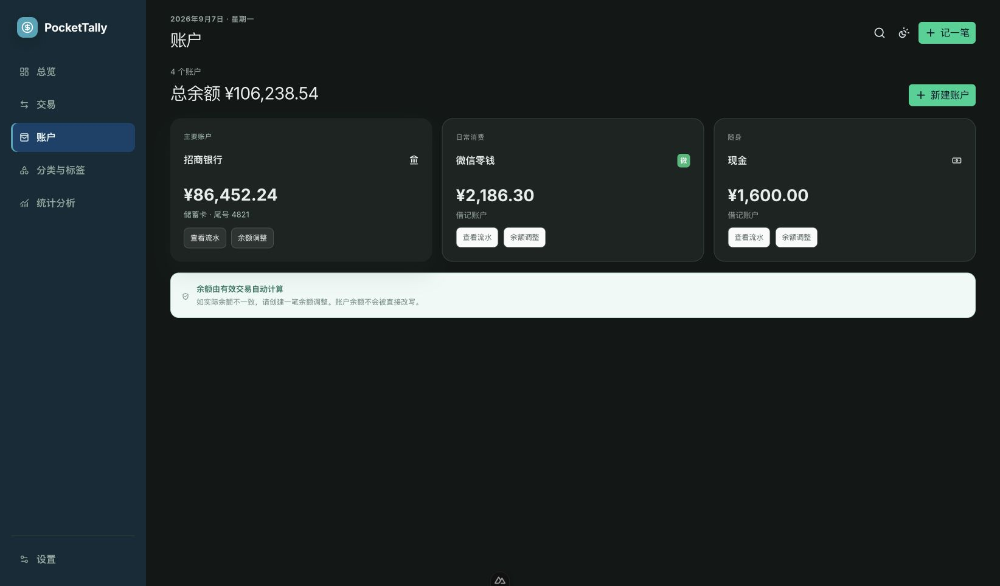 |
| 分类与标签页 | 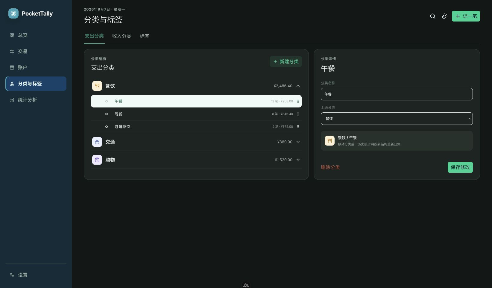 |

### 当时的验证记录

- 本地预览：`http://127.0.0.1:3000/`
- 已验证整月日历渲染 42 个日期格，年月下拉可切换历史月份。
- 已验证金额计算器、分类二级浮层、分类快捷添加、转账同账户拦截、统计累计切换和窄屏侧栏收缩。
- 已通过 Nuxt 生产构建、Python Ruff 检查和 `git diff --check`。
