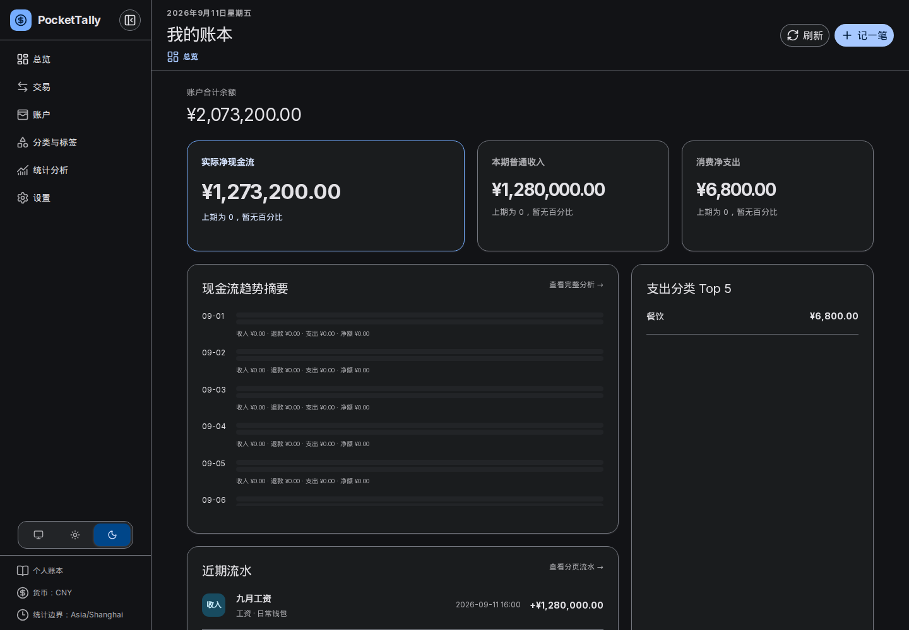
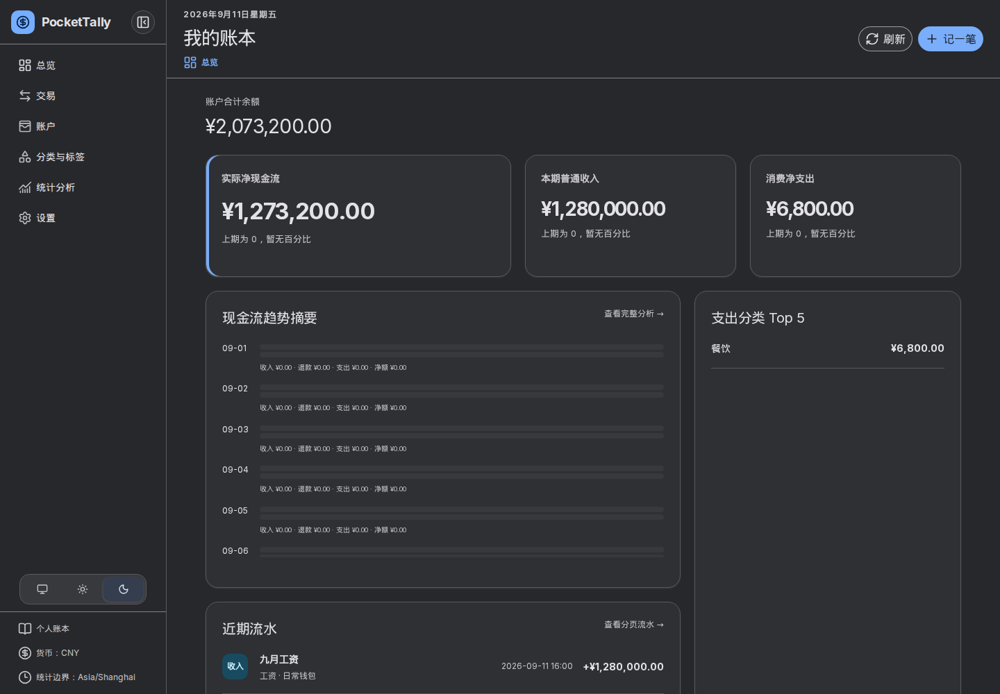
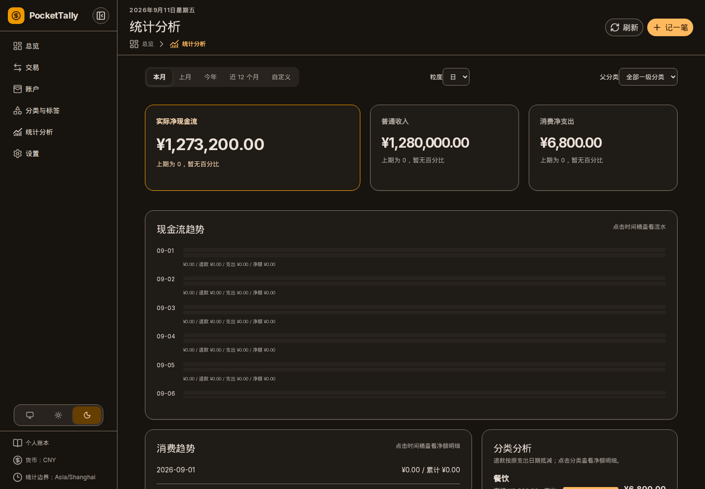
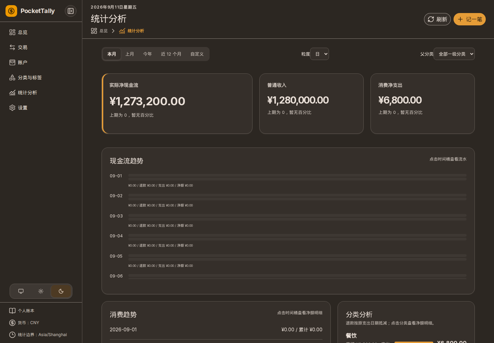
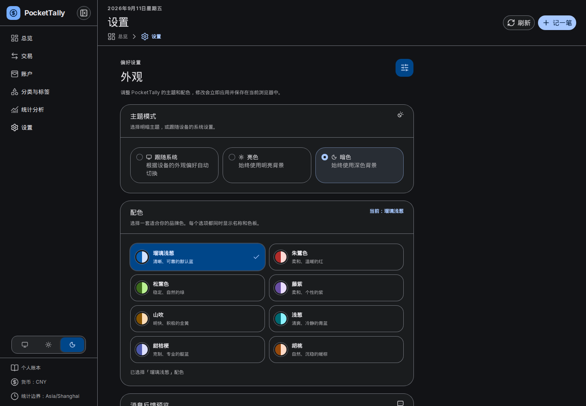
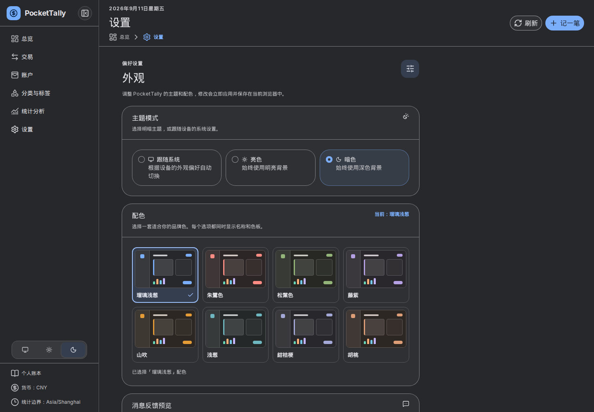

# 前端语义主题与配色契约

本文记录 Issue #27 建立、Issue #43 校准的 PocketTally 颜色契约。后续设置页、应用壳层、消息系统和业务页面必须消费这里定义的语义角色，不在组件内另建品牌色体系。

## 支持范围

PocketTally 支持亮色、暗色和跟随系统三种偏好。跟随系统只决定实际使用亮色或暗色，不形成第三套颜色。八套配色与两种实际模式组成 16 个正式支持的视觉组合。

| 配色 | 标识 | 种子色 | 视觉定位 |
| --- | --- | --- | --- |
| 瑠璃浅葱 | `ruri` | `#005CAF` | 清晰、可靠的默认蓝 |
| 朱鷺色 | `toki` | `#C73E3A` | 柔和、温暖的红 |
| 松葉色 | `matsuba` | `#42602D` | 稳定、自然的绿 |
| 藤紫 | `fuji` | `#6F5C9A` | 柔和、个性的紫 |
| 山吹 | `yamabuki` | `#FFA400` | 明快、积极的金黄 |
| 浅葱 | `asagi` | `#48929B` | 清爽、冷静的青蓝 |
| 紺桔梗 | `konkikyo` | `#191F45` | 克制、专业的靛蓝 |
| 胡桃 | `kurumi` | `#A86F4C` | 自然、沉稳的暖棕 |

种子色用于配色身份、设置页预览和静态色阶生成，不直接承担文字、按钮或焦点角色。每套配色在 `frontend/app/assets/css/theme.css` 中提供明确的 `brand-50` 至 `brand-950` 色阶；运行时只切换静态 token，不动态生成颜色。

## Token 分层

### Nuxt UI 基础角色

组件优先使用 Nuxt UI 的语义能力：

- `primary`：当前页面唯一的主要操作；
- `neutral`：次要、轮廓和幽灵操作；
- `success`、`info`、`warning`、`error`：跨配色保持固定含义的状态；
- `--ui-text-*`：文字层级；
- `--ui-bg-*`：页面、卡片、浮层和强调表面；
- `--ui-border-*`：普通、弱化、强调和反色边界。

`app.config.ts` 将 `primary` 指向自有 `brand` 色阶。禁止再将固定的 Tailwind `emerald` 或某个十六进制颜色当作全局主色。

### PocketTally 补充角色

- `--pt-primary` / `--pt-on-primary`：实色主要操作及其上的文字和图标；
- `--pt-primary-container` / `--pt-on-primary-container`：选中态、强调卡和弱强调区域；
- `--pt-focus-ring`：键盘焦点；
- `--pt-surface-page` / `card` / `muted` / `elevated` / `accented`：页面到浮层的五级表面；
- `--pt-text-dimmed` / `muted` / `toned` / `default` / `highlighted`：五级文字；
- `--pt-border-muted` / `default` / `accented`：弱、普通和强调边界；
- `--pt-chart-income`、`--pt-chart-expense`、`--pt-chart-refund`、`--pt-chart-transfer`：固定账务语义；
- `--pt-chart-category-*`、`--pt-chart-grid`、`--pt-chart-axis`：分类序列和图表基础元素。

旧页面仍使用的 `--brand`、`--ink`、`--muted`、`--line`、`--paper` 和 `--card` 是上述 token 的兼容别名，不是独立颜色来源。页面迁移到 Nuxt UI 后应优先使用正式语义角色。

## 亮色与暗色规则

亮色模式使用近白的轻染页面背景、白色卡片和较深的 Primary。选中态和强调卡使用浅色 Primary Container；侧栏使用同色相的深色反色表面。

暗色模式使用种子色 hue、HCT chroma 不高于 4 的低彩度表面，不使用纯黑。五级 surface 的基准 tone 固定为 `16 / 20 / 24 / 28 / 32`，依次映射到 `page / card / muted / elevated / accented`。Primary、Primary Container、分层文字和分层边界均为各 palette 独立静态角色，不再固定映射到 `brand-200/700`。Primary 只用于按钮、焦点、链接和少量关键数据；侧栏与页面通过边界、surface 层级和选中标记区分。

状态色和账务图表色不随品牌配色改变含义。暗色版本可以提高明度并降低使用面积，但收入、支出、退款和转账必须继续使用文字、图例、正负号或不同图形辅助表达。

## 组件用色

| 场景 | 颜色角色 | 必须同时提供的非颜色线索 |
| --- | --- | --- |
| 页面主操作 | `primary/solid` | 动作文字和可访问名称 |
| 次要操作 | `neutral/outline`、`soft` 或 `ghost` | 边界、图标或文字 |
| 危险操作 | `error` | 危险文案、图标或确认模式 |
| 导航、Tab、筛选选中 | Primary Container | 字重、图标、边缘标记或 `aria-current`/`aria-selected` |
| 指标强调卡 | Elevated Surface + 4px 起始边 Primary | 标题、更大数值和说明文字 |
| 键盘焦点 | Focus Ring | 至少 2px 可见轮廓，不以背景色变化替代 |
| 收支图表 | Chart 语义色 | 图例、标签、数值或正负号 |

用户为分类和标签保存的颜色属于账本内容，不随主题替换。展示这些颜色时必须同时显示名称、图标或数值，不能让色点独自承担含义。

## Issue #43 暗色静态 token

下表是 `theme.css` 的提交值。surface 按 `page / card / muted / elevated / accented` 排列；Primary 组按 `primary / on-primary / container / on-container` 排列。

| 配色 | Surface 五级 | Primary 四级 |
| --- | --- | --- |
| 瑠璃浅葱 | `#27282b / #2f3033 / #38393c / #414245 / #4a4b4f` | `#7aadfa / #202631 / #343e4f / #e0e2ec` |
| 朱鷺色 | `#2d2626 / #362f2e / #3f3737 / #48403f / #524949` | `#fb8b83 / #34211f / #533634 / #f5dddb` |
| 松葉色 | `#272824 / #2f312c / #383a35 / #41433e / #4a4c47` | `#93b579 / #20281a / #36412c / #e0e4d6` |
| 藤紫 | `#29272b / #323033 / #3a383c / #444145 / #4d4a4e` | `#b5a0e4 / #282431 / #413a4e / #e7e0eb` |
| 山吹 | `#2c2722 / #352f2a / #3e3833 / #47413c / #504a45` | `#e59c37 / #302314 / #4d3a23 / #f1e0d0` |
| 浅葱 | `#252829 / #2d3131 / #363a3a / #3f4343 / #494c4c` | `#6eb6c0 / #18282a / #294245 / #dae4e6` |
| 紺桔梗 | `#28272b / #303034 / #39393c / #424245 / #4c4b4f` | `#a3a8d7 / #232532 / #3a3c50 / #e3e1ec` |
| 胡桃 | `#2d2723 / #362f2c / #3f3834 / #48413d / #524a46` | `#dd9d76 / #332218 / #523828 / #f4ded3` |

文字按 `dimmed / muted / default`，边界按 `default / accented`，最后一列为 Focus Ring。

| 配色 | 文字三级 | 边界两级 | Focus Ring |
| --- | --- | --- | --- |
| 瑠璃浅葱 | `#bcbbbf / #c7c6ca / #e3e2e6` | `#838387 / #9e9da1` | `#9ec2ff` |
| 朱鷺色 | `#c5b9b7 / #d0c4c2 / #ede0de` | `#8c8180 / #a69b9a` | `#ffaba4` |
| 松葉色 | `#bcbcb5 / #c7c7c0 / #e3e3dc` | `#83847e / #9e9e98` | `#a8cb8d` |
| 藤紫 | `#bfbabf / #cac5ca / #e6e1e6` | `#868387 / #a19ca1` | `#ccb6fb` |
| 山吹 | `#c3bab3 / #cec5bd / #ebe1d9` | `#8a827c / #a59c95` | `#feb24a` |
| 浅葱 | `#b9bcbc / #c4c7c7 / #e0e3e3` | `#818485 / #9b9e9f` | `#84cdd6` |
| 紺桔梗 | `#bdbabf / #c8c5ca / #e4e1e6` | `#858387 / #9f9da1` | `#b9beed` |
| 胡桃 | `#c4b9b4 / #d0c4bf / #ece0db` | `#8b827d / #a69c97` | `#f5b28a` |

## GitHub Appearance 式配色预览

设置页使用一个 Nuxt UI `URadioGroup` 表达八个真实 radio。桌面为四列两行，窄设置页为两列；整卡可点击，并由组件提供 Tab、方向键和 Space 选择语义。每张卡的固定微型界面包含 page、侧栏、默认卡、elevated 卡、Primary 操作和四个账务图表色标，不显示真实金额。

预览容器以 `data-palette-preview` 进入与根节点相同的 CSS token 选择器，因此每个候选项读取自己的正式主题 token。Light、Dark 或 System 的实际解析结果改变时，八张预览同步更新；预览本身不修改根节点属性，也不写入 `localStorage`。选中项使用 2px 边界和勾选，焦点另有 2px 外环，hover、focus、selected 不依赖单一色相区分。视觉区域只显示名称，registry 描述合并到 radio 的可访问名称。

## 无障碍与验收

- 普通文字与背景的对比度至少为 4.5:1；
- 大字号文字、必要图标、控件边界、焦点环和图表关键图形至少为 3:1；
- 焦点环分别在页面、卡片、侧栏、实色按钮和弹层背景上检查；
- hover、pressed、active、disabled 和错误状态不能只改变色相；
- 所有 16 个组合必须通过最终计算 token 和 axe 颜色对比验收；
- Chromium 1280、1440、1920 遍历八套暗色和六个主页面；1440 对全部 48 个页面组合执行 axe 颜色对比扫描。

Issue #43 对最终计算颜色的暗色最小值如下。文字列覆盖普通、次要和 dimmed 文字；Primary 列覆盖 `primary/on-primary` 与 `container/on-container`；非文字列覆盖必要边界及 Focus Ring 对五级 surface。数值均高于对应的 `4.5:1 / 4.5:1 / 3:1` 门槛。

| 配色 | 文字最小值 | Primary 最小值 | 非文字最小值 |
| --- | ---: | ---: | ---: |
| 瑠璃浅葱 | 6.91 | 6.64 | 3.49 |
| 朱鷺色 | 6.86 | 6.59 | 3.47 |
| 松葉色 | 6.89 | 6.61 | 3.49 |
| 藤紫 | 6.84 | 6.57 | 3.49 |
| 山吹 | 6.91 | 6.64 | 3.50 |
| 浅葱 | 6.88 | 6.63 | 3.49 |
| 紺桔梗 | 6.85 | 6.61 | 3.50 |
| 胡桃 | 6.84 | 6.62 | 3.49 |

## 外观偏好兼容

外观偏好继续保存在 `pockettally-appearance`：

```json
{
  "theme": "system",
  "palette": "ruri"
}
```

现有四种配色值保持不变，新配色只扩展允许值。主题和配色字段分别验证：未知主题回退到 `system`，未知配色回退到 `ruri`。首屏脚本在 hydration 前应用偏好，并同步 Nuxt UI 使用的 `.light`/`.dark` class、`data-theme`、`data-palette` 和浏览器 `color-scheme`。

## 扩展新配色

新增配色必须同时完成以下工作：

1. 在唯一的外观 registry 中增加标识、简体中文名称、种子和描述；
2. 生成并提交完整的静态品牌色阶和 Light/Dark neutral surface；
3. 不改变 success、info、warning、error 和账务图表语义；
4. 补充单元测试和 16 组合之外的新组合验收；
5. 对浏览器最终计算颜色执行 WCAG 对比度检查，而不是只检查种子或生成参数。

## 遗留 CSS

`.transaction-summary`、`.primary-account`、`.success-toast` 和 `.detail-drawer` 当前没有对应的 Vue DOM 消费者。本次只校准仍在使用的语义角色，不继续美化这些遗留选择器；删除及最终 CSS 收口留给 Issue #37。

## 1440 设计证据

以下截图使用同一组固定账本数据、同一 Chromium 1440 × 1000 视口生成；before 来自 Issue #43 分支起点，after 来自本分支。它们用于设计审阅，不作为像素快照测试。

| 页面 | 改前 | 改后 |
| --- | --- | --- |
| 瑠璃总览 |  |  |
| 山吹统计 |  |  |
| 设置页八套配色 |  |  |
