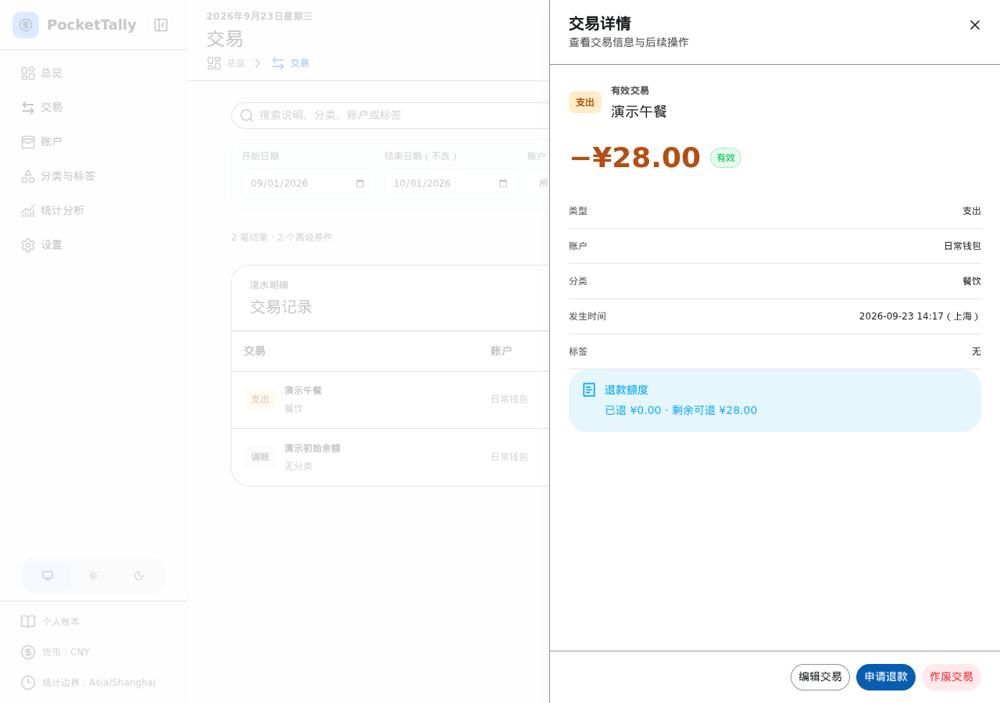

# 纠错与退款

录入错误时，可在交易详情中编辑仍有效的记录。如果整笔交易不应再影响余额，选择“作废交易”；作废保留记录，便于之后核对。已作废记录可通过交易页的状态筛选找到。

发生支出退款时，从原支出详情发起“申请退款”。系统沿用原支出的账户和分类，并限制累计退款不能超过原支出。不要再将同一笔退款记成普通收入。

_图：从原支出详情核对可退款金额并发起退款（演示数据）。_

已经产生退款关联的支出，部分字段无法继续修改；说明、发生时间和标签通常仍可调整。如果需要恢复整个账本或处理登录问题，请联系管理员，参阅[开发者文档](../developer/index.md)中的恢复流程。
