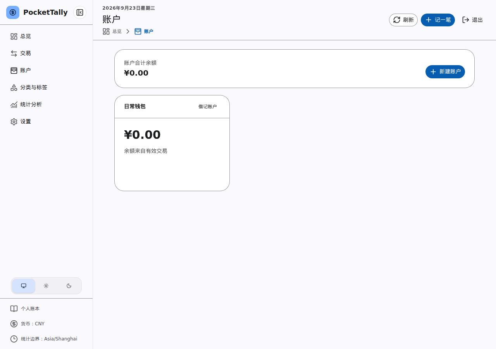
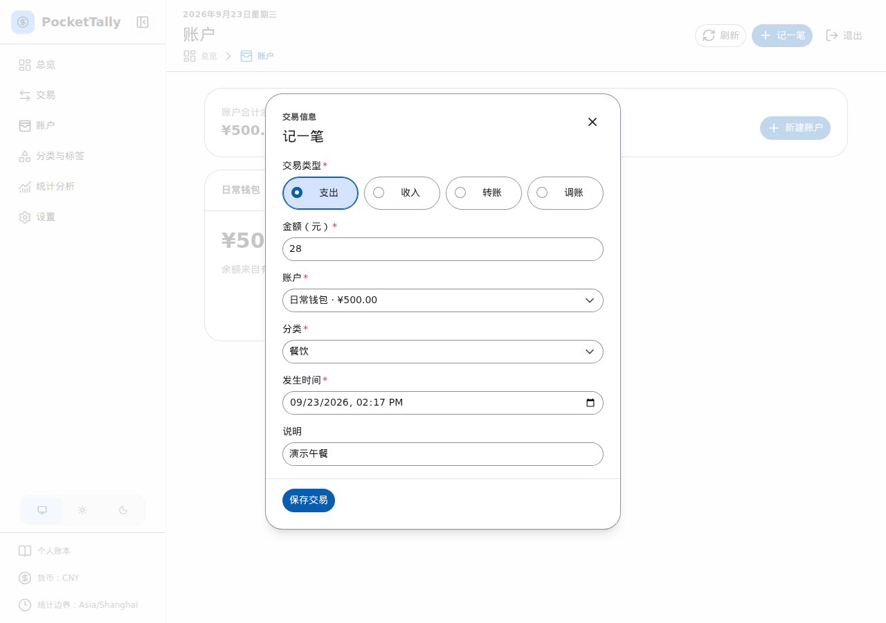

# 开始使用

PocketTally 面向单个账本所有者。请先由管理员完成部署和备份准备，然后打开管理员提供的应用地址，使用已设置的所有者账户登录。首次使用没有公开注册入口；如果尚未设置账户或忘记密码，请联系管理员。自行管理服务时，参阅[部署与认证说明](../developer/deployment.md)。

## 创建账户

在“账户”页面添加现金、银行卡或其他账户。新账户的账面余额从零开始；如果账户已有余额，请通过“记一笔”中的“调账”录入差额，不要补造一笔历史收入。保存后，检查首页余额是否与现实一致。

_图：新建账户后的账户页面（演示数据）。_

## 记录第一笔交易

点击“记一笔”，选择收入或支出，填写金额、账户与分类后保存。需要区分用途时，可以添加说明和标签。之后可到“交易”页面核对记录，并在“统计分析”查看汇总。

_图：记录一笔餐饮支出（演示数据）。_
