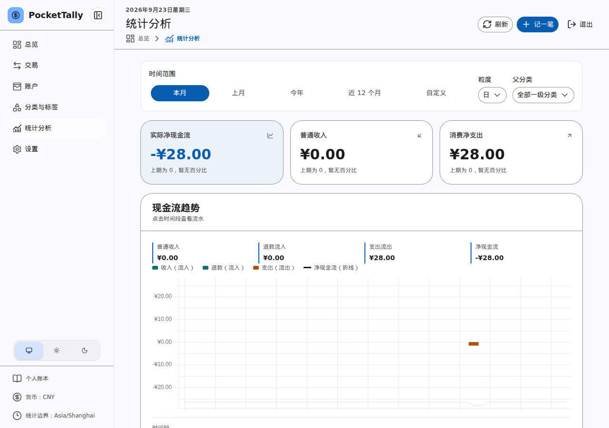

# 查询与统计

在“交易”页面，可以按说明、分类、账户或标签搜索，并用日期、类型和状态缩小范围。点击交易行查看详情；默认列表隐藏已作废交易，需要时切换状态筛选。

“统计分析”提供收支趋势、现金流、分类构成、标签及日历汇总。转账和调账只改变账户之间或账面上的余额，不会作为普通收入或支出重复计算。

_图：统计分析的期间选择与汇总卡片（演示数据）。_

当余额与预期不符时，先查看相关账户的交易及作废状态，再检查是否使用了转账、调账或退款。仍无法解释的差异可向管理员反馈，避免直接修改账本文件。
