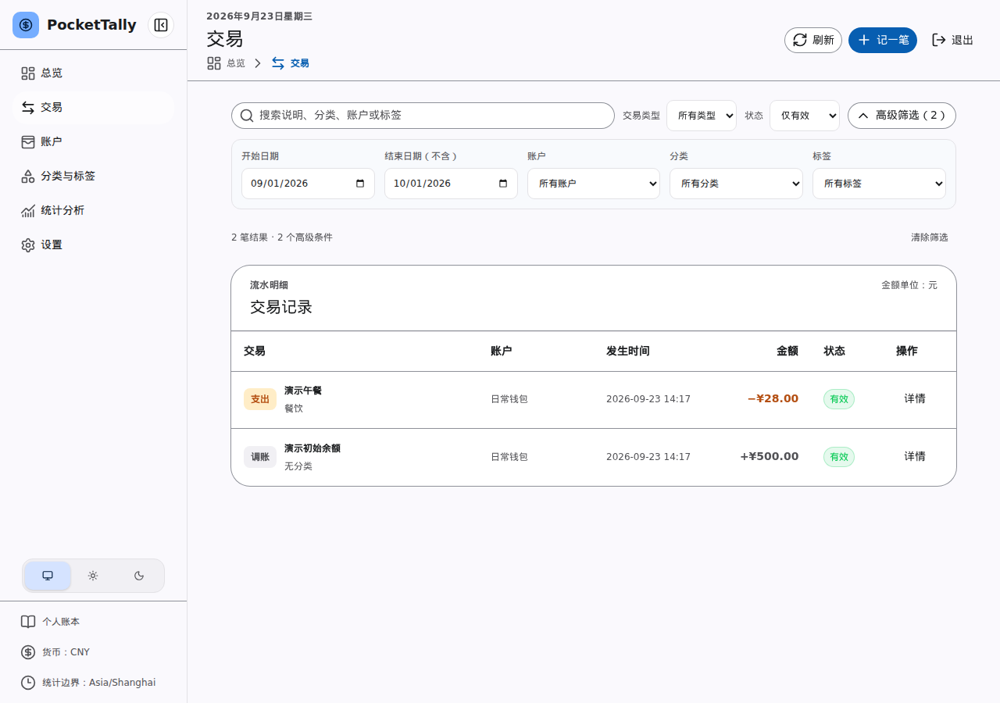

# 日常记账

点击“记一笔”，按实际发生的事项选择类型：

| 类型 | 何时使用 |
| --- | --- |
| 收入 | 工资、奖金等实际入账。 |
| 支出 | 消费或其他实际付款。 |
| 转账 | 钱在自己的两个账户之间移动。 |
| 调账 | 让账面余额与现实余额一致。 |

收入和支出需要选择对应分类；转账需要选择不同的转出、转入账户；调账不需要分类。金额输入正数，系统根据交易类型处理余额方向。每笔记录还可以填写发生时间、说明和标签。

保存后，到“交易”页面核对金额、账户和状态。需要查找旧记录时，可以使用页面顶部的搜索和筛选。

_图：交易列表及搜索筛选入口（演示数据）。_

系统预置常用收支分类。你可以在“分类与标签”页面调整分类，并用标签标记跨分类的项目或场景。已被交易使用的分类可能无法删除。

退款应从原支出详情发起，具体操作见[纠错与退款](corrections.md)。
