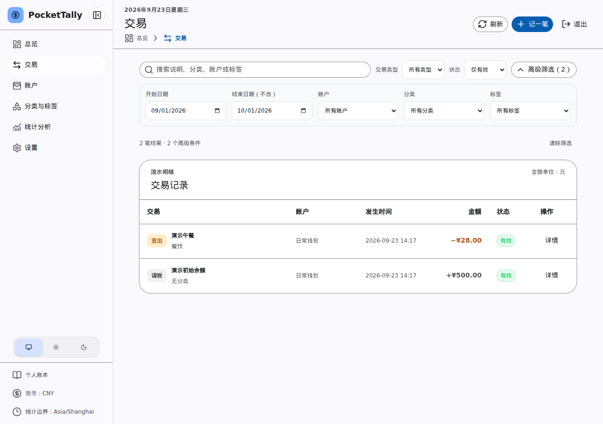

# 日常记账

点击“记一笔”，按实际发生的事项选择类型：

| 类型 | 何时使用 |
| --- | --- |
| 收入 | 工资、奖金等实际入账。 |
| 支出 | 消费或其他实际付款。 |
| 转账 | 钱在自己的两个账户之间移动。 |
| 调账 | 让账面余额与现实余额一致。 |

收入和支出需要选择对应分类；转账需要选择不同的转出、转入账户；调账不需要分类。金额输入正数，系统根据交易类型处理余额方向。每笔记录还可以填写发生时间、说明和标签。

新建收入或支出时，先从图标网格选择分类，再填写金额。有子分类的项目可以逐层进入、返回上级，或直接选择当前分类。编辑交易也按分类、金额的顺序填写；已锁定的字段不能修改。

新建交易的金额区支持数字键盘和实体键盘。输入加减算式后，按“=”查看结果；点击“完成”或“保存再记”也会先计算完整算式再保存。加减号只连接算式；按等号前，金额框持续显示完整数字和运算符，不清空数字或显示中间结果。“删除”修正上一位，当前操作数为空时返回上一个操作数；“清空”移除整个算式。金额最多保留两位小数，最终保存的金额必须大于零。

“完成”保存后关闭表单；“保存再记”成功后只清空金额和说明，保留类型、分类、账户、标签及发生时间。保存失败会保留输入，可修正后重试。编辑交易和退款使用“保存交易”，不提供计算器及“保存再记”。

保存后，到“交易”页面核对金额、账户和状态。需要查找旧记录时，可以使用页面顶部的搜索和筛选。

_图：交易列表及搜索筛选入口（演示数据）。_

系统预置常用收支分类。你可以在“分类与标签”页面调整分类，并用标签标记跨分类的项目或场景。已被交易使用的分类可能无法删除。

退款应从原支出详情发起，具体操作见[纠错与退款](corrections.md)。
